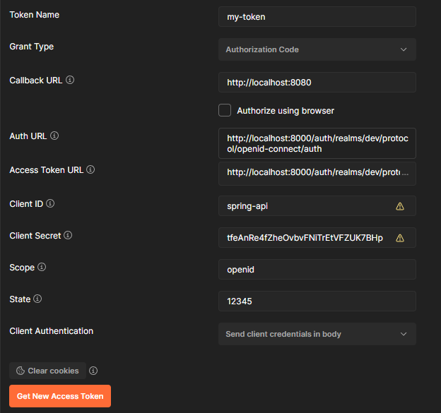

In Keycloak Admin:

Add a Realm:
- Give your Realm a name and save

Add a Client to your Realm:
- Go to clients and click "Create"
- Enter a Client ID of your choosing
- Select "openid-connect" for Client Protocol
- Save

Configure Client:
- Go to "Clients"
- In the "Settings" tab, enter a Client ID ("spring-api") and Client Name (i.e. "Spring API")
- Make sure the protocol is "openid-connect"
- Access Type should be "confidential"
- In "* Valid Redirect URLs", enter a redirect URL back to your app
- Notes:
  - this will point the user back to your application after successful authentication
Web Origins, enter URIs/IPs that should be able to access the authentication service
  - for local dev, just use the wildcard '*' to allow from any origin
- Save

Add a Client-specific Role:
Go to "Clients" and select your newly created client (e.i. "spring-api")
Click on the "Roles" tab, and click on "Add Role"
Enter a name for the Role and save

Add a Role (Optional):
- This just makes it easier to associate one or more Client Roles with a single Role
- Add an app role, something like "app_admin" or "app_user"
- Click on "Add Role"
- Type the name of the role (i.e. "app_user") in *Role 
- Optionally, add a Description
- Click "Save"
- After the role is created, go to the "Details" tab
- Toggle on the "Composite Roles" switch 
- A new "Composite Roles" menu will appear
- Click on the "Client Roles" dropdown and select your Client ID
- From the "Available Roles", add your Client-specific role or multiple role(s) (in case of an Admin or Superuser where they should get all permissions of a "user" and also the "admin" role(s))
- i.e. "app_admin" will get the "admin" and "user" roles association)

Default Roles
- To ensure that when a new user signs up they inherit the User role do the following
- Click on "Roles"
- Go to the "Default Roles" tab
- Add either the composite Realm Role "app_user" or 
- Add the Client Role "user"
- Now when a new person registers with the Keycloak UI, they will automatically get the "user" role

Default Groups
- To add a User to a Default Group as soon as they sign up
- Click on "Groups"
- Go to the "Default Groups" tab
- Click on a group (i.e. "user") from the "Available Groups" and click "Add" to move it over to "Default Groups"
- Now when a user signs up, they will be assigned to the User Group and inherit permissions available to the User role

Add User:
- Go to "Users"
- Add a new user by entering a username
- Go to the "Credentials" tab and set a password for them
- Add the appropriate Client Role(s) to the user (i.e. "user", "admin")
- Alternatively, add the the appropriate Composite Realm Role to the user (i.e. "app_user", "app_admin") where "app_admin" might contain both the "user" and "admin" Client Roles

Add a Scope:
- Go to "Client Scopes"
- Click on "Create"
- Add a *Name for the client scope (i.e. "create:comment" or "view:item")
- Add an optional Description
- Click on the "Scope" tab to map the scope to a role
- Click on the "Client Roles"  dropdown and select your Client ID
- Add your newly defined scope (i.e. "view:item") to an appropriate predefined Role, like "user (from your Client's available roles)
- Note:
  - this will allow the scope to be attached to the Role to be used as a scope in the application

Add your Scope to the defaults assigned:
- Go to "Clients", Select your Client ID
- Click on the "Client Scopes" tab
- Add your new scope to the "Assigned Default Client Scopes"
- Notes:
  - we need to add the scope by default, or otherwise request it in the "scope=" curl param
  - since the scope was added to the "user" role, it can now show up by default if a person has the "user" role assigned to them

Groups
- You can also Group together scopes and permissions by creating a Group that will auto-assign to any user in that group
- Click on "Groups"
- Add a new Group by clicking on "New"
- Add a name for your Group and Save
- Click on "Role Mappings" for that Group
- Add any Realm Roles or Client Roles for your specific app that your Group's users will need 

Configuration Notes:
- access all keycloak endpoint and configuration settings here
- http://localhost:8000/auth/realms/dev/.well-known/openid-configuration
- use these to configure Postman for API testing
- get the Keycloak Client Secret in the Keycloak dashboard
    - in your Client settings (i.e. 'spring-api'), make sure that "Access Type" is set to "confidential"
    - after that's done, you should see your Secret in the "Credentials" tab

Postman
- Example settings for authentication endpoint

- Get these settings from Endpoints: OpenID Endpoint Configuration
- "http://localhost:8000/auth/realms/$YOUR_REALM/.well-known/openid-configuration"

Docker
- Since we're separating the authentication piece as a service,
  we need to set the cert url to hit 'host.docker.internal' instead of 'localhost'
  which will reach localhost of the docker network for local dev
